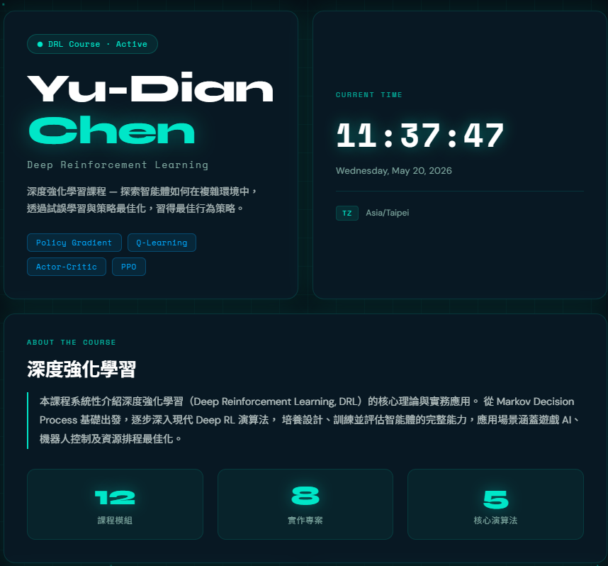

# Yu-Dian Chen — DRL Personal Page

> 深度強化學習課程個人頁面  
> 課程進度、技術棧與專案作品的線上展示


---



## 📋 專案簡介

本頁面為 **深度強化學習（Deep Reinforcement Learning, DRL）課程**的個人學習展示站，  
用於記錄課程進度、技術棧成長與專案作品，無需後端，純靜態部署於 GitHub Pages。

### 功能一覽

| 功能 | 說明 |
|------|------|
| 🕐 即時時鐘 | 每秒更新的時間 / 日期 / 時區顯示 |
| 🌐 粒子網路背景 | Canvas 繪製動態粒子連線，呼應神經網路意象 |
| 📊 數字動畫 | IntersectionObserver 觸發的 Count-up 數字 |
| 📈 技能進度條 | CSS keyframe 動畫填充漸層進度條 |
| 🃏 卡片入場動畫 | 頁面載入時各卡片依序淡入滑上 |
| 📱 響應式排版 | 手機 / 平板 / 桌機三種斷點自動適配 |

---

## 🚀 部署到 GitHub Pages（逐步教學）

### 方法一：直接上傳（適合初學者）

**Step 1** — 建立新的 GitHub Repository

1. 前往 [github.com](https://github.com) 並登入
2. 點選右上角 **+** → **New repository**
3. Repository name 填入：`drl-personal-page`（或任意名稱）
4. 設定為 **Public**（GitHub Pages 免費版需為公開）
5. 勾選 **Add a README file** → 點選 **Create repository**

**Step 2** — 上傳檔案

1. 進入剛建立的 Repository 頁面
2. 點選 **Add file** → **Upload files**
3. 將以下三個檔案拖入上傳區：
   - `index.html`
   - `style.css`
   - `README.md`
4. 在 Commit 欄填入說明（例如：`Initial commit: DRL personal page`）
5. 點選 **Commit changes**

**Step 3** — 啟用 GitHub Pages

1. 進入 Repository → 點選上方 **Settings** 分頁
2. 左側選單選擇 **Pages**
3. Source 選擇 **Deploy from a branch**
4. Branch 選擇 **main**，資料夾選 **/ (root)**
5. 點選 **Save**
6. 等待約 1～2 分鐘後，頁面頂部會顯示：  
   `Your site is live at https://YOUR-USERNAME.github.io/drl-personal-page/`

---

### 方法二：使用 Git CLI（適合熟悉指令列）

```bash
# 1. Clone 你的新 Repository
git clone https://github.com/YOUR-USERNAME/drl-personal-page.git
cd drl-personal-page

# 2. 複製這三個檔案到資料夾內
#    index.html  style.css  README.md

# 3. 提交並推送
git add .
git commit -m "feat: initial DRL personal page"
git push origin main

# 4. 前往 GitHub → Settings → Pages → 選擇 main branch → Save
```

---

## ✏️ 部署後的個人化設定

### 1. 更新 Open Graph 網址

開啟 `index.html`，找到以下兩行（約第 20–21 行），  
將 `YOUR-USERNAME` 與 `YOUR-REPO` 替換為你的實際 GitHub 帳號與 Repository 名稱：

```html
<meta property="og:url"   content="https://YOUR-USERNAME.github.io/YOUR-REPO/">
<meta property="og:image" content="https://YOUR-USERNAME.github.io/YOUR-REPO/preview.png">
```

範例：

```html
<meta property="og:url"   content="https://gh-yuxi.github.io/drl-personal-page/">
<meta property="og:image" content="https://gh-yuxi.github.io/drl-personal-page/preview.png">
```

### 2. 新增社群預覽圖

截取網頁畫面並儲存為 `preview.png`（建議尺寸：1200 × 630 px），  
上傳到 Repository 根目錄，即可在 LINE / Discord / Twitter 等平台分享時顯示預覽卡。

### 3. 自訂內容

| 要修改的內容 | 檔案 | 位置關鍵字 |
|-------------|------|-----------|
| 姓名 | `index.html` | `hero-name` |
| 課程說明 | `index.html` | `about-text` |
| 技能與百分比 | `index.html` | `skill-item` |
| 專案描述 | `index.html` | `project-item` |
| 課程統計數字 | `index.html` | `data-target` |
| 主題色 | `style.css` | `:root` 變數區塊 |

---

## 📁 檔案結構

```
drl-personal-page/
├── index.html     # 主要頁面（HTML + 內嵌 JS）
├── style.css      # 樣式表（CSS 變數 + 動畫）
└── README.md      # 本說明文件
```

---

## 🎨 設計說明

| 項目 | 選擇 | 原因 |
|------|------|------|
| 主色調 | `#050e14` 深藍黑 | 科技感、低干擾 |
| 強調色 | `#00e6c8` Cyan | 清新高亮、對比鮮明 |
| 輔助色 | `#00aaff` 電藍 / `#b8ff57` 萊姆 | 多層次視覺層次 |
| 標題字型 | Syne 800 | 幾何稜角、強烈個性 |
| 程式碼字型 | Space Mono | 終端機氛圍 |
| 內文字型 | DM Sans | 清晰易讀 |
| 設計語言 | Glassmorphism + 粒子網路 | 呼應神經網路意象 |

---

## 🛠️ 技術棧

- **HTML5** — 語意化標籤、ARIA 無障礙屬性
- **CSS3** — Custom Properties、Grid、`backdrop-filter`、`@keyframes`
- **Vanilla JavaScript** — Canvas API、IntersectionObserver、`Intl` 時區
- **Google Fonts** — Syne、DM Sans、Space Mono
- **GitHub Pages** — 靜態網站免費託管

---

## 📄 授權

MIT License — 自由修改與使用，歡迎 Fork。

---

*深度強化學習課程 · Yu-Dian Chen · 2026*
